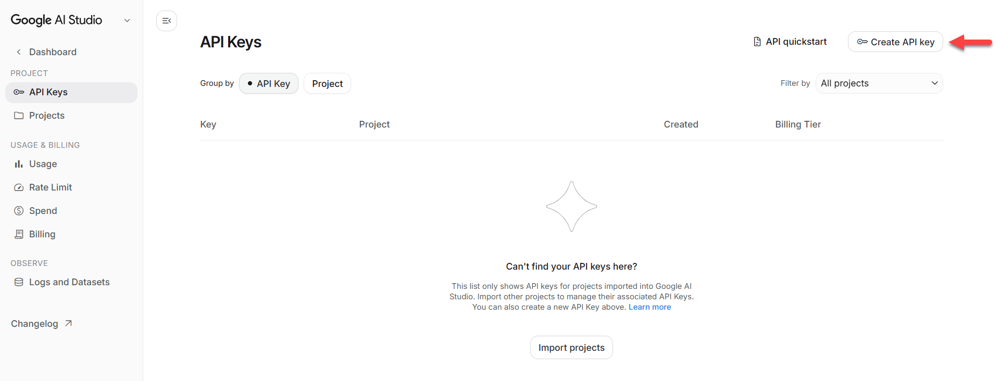
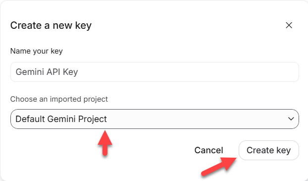
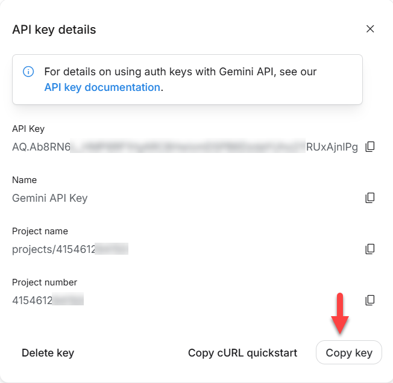
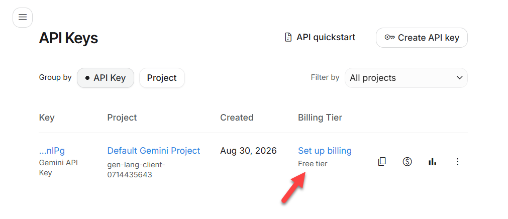

## Cách tạo API Key miễn phí trên AI Studio
Truy cập địa chỉ lấy API Key: https://aistudio.google.com/api-keys

Rồi làm theo các bước sau:

  
   <em>Bước 1</em>

  
   <em>Bước 2</em>

  
   <em>Bước 3</em>

  
   <em>Bước 4: Thấy key có chữ `Free tier`, nghĩa là bạn đã tạo đúng Key miễn phí</em>

Sử dụng Key miễn phí, bạn không cần liên kết bất kỳ thẻ thanh toán nào vào Gemini.
